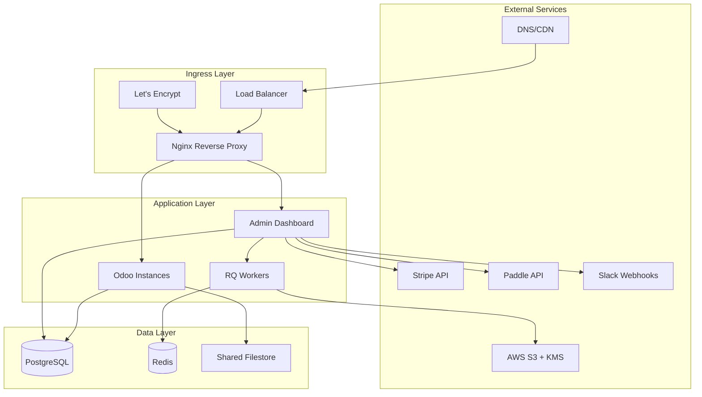

# Odoo SaaS Bundle - Multi-Tenant Enterprise Solution

[](https://www.gnu.org/licenses/agpl-3.0)
[](https://www.odoo.com/)
[](https://www.docker.com/)
[](https://kubernetes.io/)

A **production-grade, multi-tenant Odoo deployment platform** with enterprise features including automated backups, billing integration, and comprehensive admin dashboard.

## 🎯 Key Features

### Core Platform
- **🏢 Multi-Tenant Architecture** - Complete database isolation per tenant with PostgreSQL
- **🎛️ Admin Dashboard** - Web-based control panel for tenant management
- **🔐 RBAC Security** - Role-based access control (Owner/Admin/Viewer)
- **📊 Usage Monitoring** - Track database size, active users, and resource quotas
- **📝 Audit Logging** - Complete audit trail of all administrative actions

### Enterprise Features
- **💾 Automated Backups** - S3 storage with KMS encryption and lifecycle policies
- **💳 Billing Integration** - Native Stripe & Paddle webhook support
- **📦 Module Management** - Install/upgrade/remove modules per tenant
- **🔄 Job Queue System** - Async processing with Redis/RQ
- **📧 Alert System** - Email and Slack notifications
- **🔒 SSL/TLS** - Let's Encrypt integration with auto-renewal

### Deployment Options
- **🐳 Docker** - Complete docker-compose stack
- **☸️ Kubernetes** - Production-ready K8s manifests with KEDA autoscaling
- **🖥️ Bare Metal** - Direct host installation scripts
- **☁️ Multi-Cloud** - Support for AWS, Azure, GCP, and Oracle Cloud

## 📋 Table of Contents

- [Architecture](#-architecture)
- [Prerequisites](#-prerequisites)
- [Quick Start](#-quick-start)
  - [Docker Deployment](#docker-deployment)
  - [Kubernetes Deployment](#kubernetes-deployment)
  - [Host Installation](#host-installation)
- [Configuration](#-configuration)
- [Post-Installation](#-post-installation)
- [Operations Guide](#-operations-guide)
- [API Documentation](#-api-documentation)
- [Troubleshooting](#-troubleshooting)
- [Security](#-security)
- [Contributing](#-contributing)
- [Support](#-support)

## 🏗️ Architecture



### Component Overview

| Component | Purpose | Technology |
|-----------|---------|------------|
| **Odoo** | ERP Application Server | Python, PostgreSQL |
| **Admin Dashboard** | Tenant Management UI | Flask, SQLAlchemy |
| **PostgreSQL** | Multi-tenant Database | PostgreSQL 15 |
| **Redis** | Job Queue & Cache | Redis 7 |
| **Nginx** | Reverse Proxy & TLS | Nginx, Let's Encrypt |
| **Workers** | Background Jobs | Python RQ |
| **S3** | Backup Storage | AWS S3 with KMS |

## 📦 Prerequisites

### System Requirements

#### Minimum (Development)
- **CPU**: 2 cores
- **RAM**: 4 GB
- **Storage**: 20 GB SSD
- **OS**: Ubuntu 22.04 LTS / Debian 11

#### Recommended (Production)
- **CPU**: 8+ cores
- **RAM**: 16+ GB
- **Storage**: 100+ GB SSD
- **OS**: Ubuntu 22.04 LTS
- **Database**: External PostgreSQL (RDS/Cloud SQL)

### Software Requirements

#### For Docker Deployment
```bash
# Docker & Docker Compose
docker --version  # >= 20.10
docker-compose --version  # >= 2.20

# Optional tools
kubectl --version  # For K8s deployment
terraform --version  # For infrastructure
```

#### For Host Installation
```bash
# System packages
sudo apt update
sudo apt install -y \
    python3.10+ \
    postgresql-15 \
    redis-server \
    nginx \
    git \
    curl
```

## 🚀 Quick Start

### Docker Deployment

#### 1. Clone Repository
```bash
git clone https://github.com/marcosfermin/odoo-saas-bundle.git
cd odoo-saas-bundle
```

#### 2. Configure Environment
```bash
# Copy environment template
cp .env.example .env

# Edit configuration (IMPORTANT: Change all CHANGEME_ values)
nano .env

# Generate secure passwords
openssl rand -hex 32  # For SECRET_KEY
openssl rand -base64 32  # For passwords
```

#### 3. Create Admin Credentials
```bash
# Create HTTP basic auth for admin panel
docker run --rm -it \
    -v "$(pwd)/config/nginx:/etc/nginx" \
    nginx:alpine sh -c \
    'apk add --no-cache apache2-utils && \
     htpasswd -c /etc/nginx/.admin_htpasswd admin'
```

#### 4. Launch Platform
```bash
# Build and start all services
docker-compose up -d --build

# Check status
docker-compose ps

# View logs
docker-compose logs -f odoo admin
```

#### 5. Scale Workers (Optional)
```bash
# Scale RQ workers
docker-compose up -d --scale admin_workers=5

# With production config
docker-compose -f docker-compose.yml \
    -f docker-compose.prod.yml \
    up -d --scale admin_workers=3
```

### Kubernetes Deployment

#### 1. Prerequisites
```bash
# Verify cluster access
kubectl cluster-info

# Install required components
# NGINX Ingress Controller
helm upgrade --install ingress-nginx ingress-nginx \
    --repo https://kubernetes.github.io/ingress-nginx \
    --namespace ingress-nginx --create-namespace

# cert-manager for TLS
kubectl apply -f https://github.com/cert-manager/cert-manager/releases/download/v1.13.0/cert-manager.yaml

# KEDA for autoscaling (optional)
kubectl apply -f https://github.com/kedacore/keda/releases/download/v2.12.0/keda-2.12.0.yaml
```

#### 2. Configure Secrets
```bash
# Edit secrets
nano k8s/03-secrets/app-secrets.yaml

# Create basic auth secret
htpasswd -nb admin yourpassword | base64 -w0
# Add output to k8s/03-secrets/basic-auth-secret.yaml

# Mark as configured
touch k8s/03-secrets/configured
```

#### 3. Deploy Platform
```bash
# Use deployment script
chmod +x deploy.sh
./deploy.sh kubernetes

# Or manually apply in order
kubectl apply -f k8s/00-namespace.yaml
kubectl apply -f k8s/01-clusterissuer-letsencrypt.yaml
kubectl apply -f k8s/02-configmaps/ -R
kubectl apply -f k8s/03-secrets/ -R
kubectl apply -f k8s/10-redis/ -R
kubectl apply -f k8s/20-odoo/ -R
kubectl apply -f k8s/30-admin/ -R
kubectl apply -f k8s/40-odoo-hpa.yaml
kubectl apply -f k8s/90-ingress.yaml
```

#### 4. Configure Storage (Choose One)
```bash
# AWS EFS
kubectl apply -f k8s/storage/aws-efs.yaml

# Azure Files
kubectl apply -f k8s/storage/azure-files.yaml

# GKE Filestore
kubectl apply -f k8s/storage/gke-filestore.yaml

# Oracle FSS
kubectl apply -f k8s/storage/oci-fss.yaml
```

#### 5. Verify Deployment
```bash
# Check pods
kubectl get pods -n odoo-saas

# Check ingress
kubectl get ingress -n odoo-saas

# Check certificates
kubectl get certificate -n odoo-saas

# View logs
kubectl logs -n odoo-saas deployment/admin
```

### Host Installation

#### 1. Run Installation Scripts
```bash
# Clone repository
git clone https://github.com/marcosfermin/odoo-saas-bundle.git
cd odoo-saas-bundle

# Run as root
sudo bash scripts/install_saas.sh
sudo bash scripts/install_admin.sh
```

#### 2. Configure Services
```bash
# Edit Odoo configuration
sudo nano /etc/odoo.conf
# Update: admin_passwd

# Edit Admin configuration
sudo nano /opt/odoo-admin/.env
# Update: All CHANGEME_ values
```

#### 3. Configure Nginx
```bash
# Copy and configure Nginx
sudo cp config/nginx/site.conf /etc/nginx/sites-available/odoo.conf

# Fix upstreams for host installation
sudo sed -i 's/server odoo:/server 127.0.0.1:/g' /etc/nginx/sites-available/odoo.conf
sudo sed -i 's/server admin:/server 127.0.0.1:/g' /etc/nginx/sites-available/odoo.conf

# Enable site
sudo ln -sf /etc/nginx/sites-available/odoo.conf /etc/nginx/sites-enabled/
sudo nginx -t && sudo systemctl reload nginx
```

#### 4. Start Services
```bash
# Start all services
sudo systemctl start odoo odoo-admin
sudo systemctl start odoo-admin-worker@{1..3}

# Enable autostart
sudo systemctl enable odoo odoo-admin
sudo systemctl enable odoo-admin-worker@{1..3}

# Check status
sudo systemctl status odoo odoo-admin
```

## ⚙️ Configuration

### Essential Configuration

#### 1. Database Configuration
```env
PG_HOST=postgres
PG_PORT=5432
PG_USER=odoo
PG_PASSWORD=strong_password_here
```

#### 2. Domain Configuration
```env
DOMAIN=odoo.example.com
ADMIN_DOMAIN=admin.odoo.example.com
```

#### 3. Security Keys
```env
SECRET_KEY=generate_32_char_random_string
ODOO_MASTER_PASSWORD=change_this_master_password
```

#### 4. S3 Backup Configuration
```env
AWS_REGION=us-east-1
S3_BUCKET=odoo-saas-backups
S3_KMS_KEY_ID=arn:aws:kms:region:account:key/id
```

### Infrastructure Setup (Terraform)

#### Deploy S3 + KMS
```bash
cd terraform
terraform init

terraform apply \
    -var="bucket_name=odoo-backups-prod" \
    -var="aws_region=us-east-1" \
    -var="kms_key_alias=odoo-backups" \
    -var="lifecycle_days=30"

# Save outputs
terraform output > ../terraform-outputs.txt
```

### TLS Certificate Setup

#### Option 1: HTTP-01 Challenge (Standard)
```bash
# Set domains
export DOMAIN=odoo.example.com
export EMAIL=admin@example.com

# Issue certificate
bash scripts/letsencrypt_webroot.sh

# Setup auto-renewal (cron)
echo "0 2 * * * cd /path/to/odoo-saas && bash scripts/letsencrypt_webroot.sh renew" | crontab -
```

#### Option 2: DNS-01 Challenge (Wildcard)
```bash
# Set Cloudflare token
export CLOUDFLARE_API_TOKEN=your_token_here

# Issue wildcard certificate
bash scripts/letsencrypt_cloudflare_wildcard.sh

# Setup auto-renewal
echo "0 2 * * * cd /path/to/odoo-saas && CLOUDFLARE_API_TOKEN=token bash scripts/letsencrypt_cloudflare_wildcard.sh renew" | crontab -
```

## 📋 Post-Installation

### 1. Verify Installation
```bash
# Run test suite
chmod +x test.sh
./test.sh

# Test endpoints manually
curl -I https://odoo.example.com/web/login
curl -I https://admin.odoo.example.com/health
```

### 2. Create First Admin User
```bash
# Access admin dashboard
https://admin.odoo.example.com

# Default credentials (from .env)
Email: owner@example.com
Password: (BOOTSTRAP_PASSWORD from .env)
```

### 3. Create First Tenant
```bash
# Via Admin Dashboard UI
1. Login to https://admin.odoo.example.com
2. Navigate to Tenants → Create
3. Enter tenant name (e.g., "company1")
4. Set quota (default: 5GB)
5. Click Create

# Tenant will be accessible at:
https://company1.odoo.example.com
```

### 4. Configure Billing Webhooks

#### Stripe Setup
```bash
1. Go to Stripe Dashboard → Webhooks
2. Add endpoint: https://admin.odoo.example.com/webhooks/billing
3. Select events:
   - invoice.payment_succeeded
   - invoice.payment_failed
   - subscription.deleted
4. Copy signing secret to .env (STRIPE_SIGNING_SECRET)
5. Restart admin service
```

#### Paddle Setup
```bash
1. Go to Paddle → Developer Tools → Webhooks
2. Add URL: https://admin.odoo.example.com/webhooks/billing
3. Download RSA public key
4. Convert to Base64:
   cat paddle_public_key.txt | base64 -w0
5. Add to .env (PADDLE_PUBLIC_KEY_BASE64)
6. Restart admin service
```

### 5. Setup Monitoring

#### Prometheus Metrics
```yaml
# Add to prometheus.yml
scrape_configs:
  - job_name: 'odoo-saas'
    static_configs:
      - targets:
        - 'odoo.example.com:9090'
        - 'admin.odoo.example.com:9116'
```

#### Grafana Dashboards
```bash
# Import dashboards
kubectl apply -f k8s/grafana/dashboards/
```

## 📖 Operations Guide

### Tenant Management

#### Create Tenant
```bash
# Via UI
Admin Dashboard → Tenants → Create

# Via API
curl -X POST https://admin.odoo.example.com/api/tenants \
    -H "Authorization: Bearer $API_KEY" \
    -d '{"name": "tenant1", "quota_gb": 5}'
```

#### Suspend/Unsuspend Tenant
```bash
# Suspend (blocks access)
Admin Dashboard → Tenant → Suspend

# Unsuspend
Admin Dashboard → Tenant → Unsuspend
```

#### Delete Tenant
```bash
# WARNING: This is permanent!
Admin Dashboard → Tenant → Delete
# Confirm deletion
```

### Backup & Restore

#### Manual Backup
```bash
# Via UI
Admin Dashboard → Tenant → Backup

# Via CLI (host)
pg_dump -Fc tenant_db > backup.dump
aws s3 cp backup.dump s3://bucket/tenants/tenant_db/backup.dump
```

#### Restore from Backup
```bash
# Via UI
Admin Dashboard → Restore
Enter S3 key: tenants/tenant_db/2024/01/15/backup.dump

# Via CLI
aws s3 cp s3://bucket/tenants/tenant_db/backup.dump .
pg_restore -c -d new_tenant_db backup.dump
```

#### Automated Backups
```bash
# Add to crontab
0 2 * * * /opt/odoo-saas/scripts/backup_all_tenants.sh
```

### Module Management

#### Install Modules
```bash
Admin Dashboard → Modules
Tenant: select tenant
Install: sale,crm,website
Click Queue
```

#### Upgrade Modules
```bash
Admin Dashboard → Modules
Tenant: select tenant
Upgrade: base,stock
Click Queue
```

### Monitoring & Alerts

#### Check Logs
```bash
# Docker
docker-compose logs -f odoo admin

# Kubernetes
kubectl logs -n odoo-saas deployment/admin -f

# Host
journalctl -u odoo -f
journalctl -u odoo-admin -f
```

#### Setup Alerts
```env
# Slack
SLACK_WEBHOOK_URL=https://hooks.slack.com/services/XXX

# Email
SMTP_HOST=smtp.gmail.com
ALERT_EMAIL_TO=ops@example.com
```

### Scaling

#### Docker Scaling
```bash
# Scale Odoo workers
docker-compose up -d --scale odoo=3

# Scale RQ workers
docker-compose up -d --scale admin_workers=5
```

#### Kubernetes Scaling
```bash
# Manual scaling
kubectl scale deployment odoo --replicas=5 -n odoo-saas

# Autoscaling with HPA
kubectl apply -f k8s/40-odoo-hpa.yaml

# KEDA autoscaling for workers
kubectl apply -f k8s/30-admin/admin-workers-keda.yaml
```

## 🔌 API Documentation

### Authentication
```bash
# Bearer token
curl -H "Authorization: Bearer $API_KEY" \
    https://admin.odoo.example.com/api/tenants
```

### Endpoints

#### GET /api/tenants
List all tenants
```json
{
  "tenants": [
    {
      "id": "tenant1",
      "url": "https://tenant1.odoo.example.com",
      "users": 5,
      "size_gb": 1.2,
      "quota_gb": 5,
      "suspended": false
    }
  ]
}
```

#### POST /api/tenants
Create new tenant
```bash
curl -X POST https://admin.odoo.example.com/api/tenants \
    -H "Content-Type: application/json" \
    -d '{"name": "tenant2", "quota_gb": 10}'
```

#### DELETE /api/tenants/{id}
Delete tenant
```bash
curl -X DELETE https://admin.odoo.example.com/api/tenants/tenant2
```

#### POST /api/tenants/{id}/backup
Trigger backup
```bash
curl -X POST https://admin.odoo.example.com/api/tenants/tenant1/backup
```

### Webhooks

#### Billing Webhook
```http
POST /webhooks/billing
Content-Type: application/json
X-Webhook-Secret: your_secret

{
  "type": "payment.failed",
  "tenant": "tenant1",
  "amount": 99.00
}
```

## 🔧 Troubleshooting

### Common Issues

#### 1. Odoo Won't Start
```bash
# Check logs
docker-compose logs odoo
journalctl -u odoo -n 100

# Common fixes:
- Check PostgreSQL connection
- Verify master password in config
- Ensure proper file permissions
```

#### 2. Admin Dashboard 502 Error
```bash
# Check service
docker-compose ps admin
systemctl status odoo-admin

# Check port binding
netstat -tlnp | grep 9090

# Fix: Ensure DOCKER_ENV=1 in Dockerfile
```

#### 3. Backup Failures
```bash
# Check S3 permissions
aws s3 ls s3://your-bucket/

# Verify KMS key access
aws kms describe-key --key-id $KMS_KEY_ID

# Check disk space
df -h
```

#### 4. Certificate Issues
```bash
# Check certificate status
kubectl describe certificate -n odoo-saas

# Renew manually
bash scripts/letsencrypt_webroot.sh renew

# Check DNS
dig odoo.example.com
```

#### 5. Database Connection Issues
```bash
# Test connection
psql -h localhost -U odoo -d postgres

# Check PostgreSQL logs
docker-compose logs postgres
journalctl -u postgresql
```

### Performance Tuning

#### Odoo Configuration
```ini
# /etc/odoo.conf
workers = 8  # 2 * CPU cores + 1
limit_memory_hard = 2684354560  # 2.5GB
limit_memory_soft = 2147483648  # 2GB
max_cron_threads = 2
```

#### PostgreSQL Tuning
```sql
-- Adjust shared_buffers
ALTER SYSTEM SET shared_buffers = '4GB';

-- Connection pooling
ALTER SYSTEM SET max_connections = 200;

-- Restart required
SELECT pg_reload_conf();
```

#### Redis Configuration
```conf
# /etc/redis/redis.conf
maxmemory 2gb
maxmemory-policy allkeys-lru
```

## 🔒 Security

### Security Checklist

- [ ] **Change all default passwords**
- [ ] **Enable TLS/SSL everywhere**
- [ ] **Configure firewall rules**
- [ ] **Enable audit logging**
- [ ] **Setup backup encryption**
- [ ] **Configure RBAC properly**
- [ ] **Enable rate limiting**
- [ ] **Regular security updates**
- [ ] **Monitor access logs**
- [ ] **Setup intrusion detection**

### Best Practices

#### 1. Secret Management
```bash
# Never commit secrets
echo ".env" >> .gitignore

# Use secret managers in production
- AWS Secrets Manager
- HashiCorp Vault
- Kubernetes Secrets
```

#### 2. Network Security
```bash
# Firewall rules (UFW)
sudo ufw allow 22/tcp
sudo ufw allow 80/tcp
sudo ufw allow 443/tcp
sudo ufw enable
```

#### 3. Database Security
```sql
-- Create read-only user
CREATE USER readonly WITH PASSWORD 'password';
GRANT CONNECT ON DATABASE odoo TO readonly;
GRANT SELECT ON ALL TABLES IN SCHEMA public TO readonly;

-- Enable SSL
ALTER SYSTEM SET ssl = on;
```

#### 4. Container Security
```yaml
# Run as non-root
securityContext:
  runAsNonRoot: true
  runAsUser: 1000
  readOnlyRootFilesystem: true
```

## 🤝 Contributing

We welcome contributions! Please see our [Contributing Guide](CONTRIBUTING.md) for details.

### Development Setup
```bash
# Fork and clone
git clone https://github.com/marcosfermin/odoo-saas-bundle.git
cd odoo-saas-bundle

# Create branch
git checkout -b feature/your-feature

# Make changes and test
./test.sh

# Submit PR
```

## 📞 Support

### Commercial Support
- Email: marcos@contaura.com
- Phone: +1-347-201-8958
- [Official Website](https://contaura.com)

### Bug Reports
Please report bugs via [GitHub Issues](https://github.com/marcosfermin/odoo-saas-bundle/issues)

## 📄 License

This project is licensed under the GNU Affero General Public License v3.0 - see the [LICENSE](LICENSE) file for details.

### Third-Party Licenses
- Odoo: LGPLv3
- PostgreSQL: PostgreSQL License
- Redis: BSD License
- Nginx: 2-clause BSD License

## 🙏 Acknowledgments

- Odoo SA for the excellent ERP platform
- The open-source community for invaluable contributions
- All contributors and testers

---

**Built with ❤️ by Marcos Fermin**
