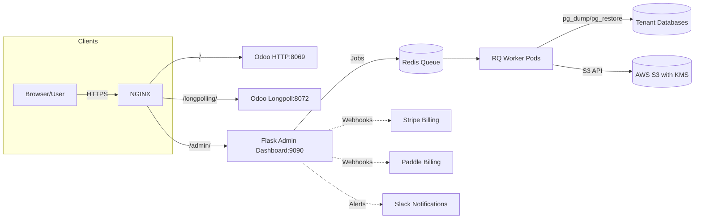

# Odoo SaaS Platform

The **Odoo SaaS Platform** is a **production-grade, multi-tenant deployment system** built to run Odoo as a Software-as-a-Service offering.

It provides:

- **Multi-tenant architecture** with PostgreSQL database isolation per tenant.
- **Admin Dashboard** for managing tenants, modules, quotas, and billing.
- **Per-tenant S3 backups** with **AWS KMS encryption** and automated lifecycle policies.
- **Stripe and Paddle integration** for subscription billing and webhook automation.
- **RBAC (Role-Based Access Control)** and **audit logs** for compliance and secure operations.
- **Docker and Kubernetes deployment paths** with full scalability.
- **Observability stack**: Prometheus ServiceMonitors and Grafana dashboards included.

---

## Key Features

| Feature                  | Description |
|--------------------------|-------------|
| **Multi-tenancy**        | Each tenant has its own isolated database with controlled access. |
| **Admin Dashboard**      | Manage tenants, modules, backups, billing, and quotas from a web UI. |
| **Automated Backups**    | Per-tenant backups stored in S3 with KMS encryption. |
| **Billing Integration**  | Native Stripe & Paddle webhooks for automatic suspension toggles. |
| **Autoscaling**          | KEDA-powered scaling for RQ workers and longpolling Odoo nodes. |
| **Security-First Design**| TLS, IRSA for AWS, RBAC, audit trails, webhook signature validation. |
| **Full Observability**   | Grafana dashboards, Prometheus exporters, and alert rules included. |

---

## Supported Clouds

| Cloud Provider | RWX Storage Option | Notes |
|----------------|--------------------|-------|
| AWS EKS        | Amazon EFS         | IRSA integration supported |
| Azure AKS      | Azure Files        | Managed SMB volume support |
| GCP GKE        | Filestore          | Easy NFS setup |
| Oracle OCI OKE | File Storage       | Enterprise-grade NFS |

---

## Architecture Diagram



---

## Repository Layout

```
.
├── admin/                # Flask Admin Dashboard
├── app/                  # Application core code
├── config/               # Odoo + Nginx configs
├── docs/                 # Documentation
├── k8s/                  # Kubernetes manifests
├── scripts/              # Installation & automation scripts
├── systemd/              # Systemd service templates
├── terraform/            # Infrastructure provisioning
├── docker-compose.yml    # Core services (Docker)
└── README.md
```

---

## Next Steps

- **[Quick Start](quickstart/docker.md)**: Run locally with Docker Compose.
- **[Kubernetes Deploy](quickstart/kubernetes.md)**: Deploy to production clusters.
- **[Operations](ops/tenants.md)**: Manage tenants, backups, modules, and billing.
